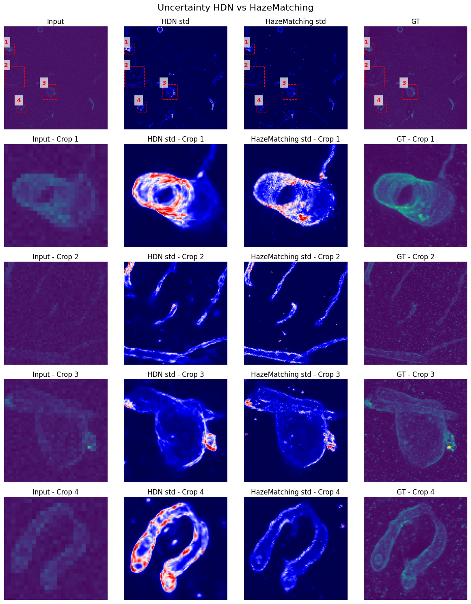

  

# Project #23: Enhancing the effective resolution of intravital microscopy with digital expansion microscopy

This page was created by the [AI4Life
project](https://ai4life.eurobioimaging.eu) using data
provided by Varun Venkataramani, MD, PhD, and Ekin Reyhan
([Venkataramani Lab](https://venkataramani-lab.com/),
[University Hospital
Heidelberg](https://www.klinikum.uni-heidelberg.de/)).

In case of any questions, please open an issue or contact us at
ai4life@fht.org!

**Project challenges**: super-resolution, uncertainty estimation

## Table of Contents

- [Project #23: Enhancing the effective resolution of intravital microscopy with digital expansion microscopy](#project-23-enhancing-the-effective-resolution-of-intravital-microscopy-with-digital-expansion-microscopy)
  - [Table of Contents](#table-of-contents)
  - [1. Introduction](#1-introduction)
  - [2. Project results](#2-project-results)
    - [2.1 Methods](#21-methods)
      - [2.1.1 CARE](#211-care)
      - [2.1.2 HDN (VAE)](#212-hdn-vae)
      - [2.1.3 HazeMatching](#213-hazematching)
      - [2.1.4 Method comparison on validation dataset](#214-method-comparison-on-validation-dataset)
    - [2.2 Single prediction vs MMSE](#22-single-prediction-vs-mmse)
    - [2.3 Uncertainty estimation](#23-uncertainty-estimation)
    - [2.4 Method comparison on real data](#24-method-comparison-on-real-data)
  - [3. Limitations](#3-limitations)
  - [4. Conclusion](#4-conclusion)
  - [5. References](#5-references)
    - [5.1 Referenced papers](#51-referenced-papers)
    - [5.2 Referenced software](#52-referenced-software)

## 1. Introduction

In-vivo two-photon microscopy is an essential technique in neuroscience
and oncology, but its diffraction-limited resolution often hinders the
study of subcellular and dynamic structures. To overcome this,
researchers commonly turn to expansion microscopy, which physically
enlarges biological specimens to enable higher-resolution imaging. While
effective, this method is resource-intensive and not suitable for live
imaging.

   
*Figure 1: data imaged pre- and post- expansion*

To address these limitations, the [researchers](https://venkataramani-lab.com/) from Neurology Clinic and
National Center for Tumor Diseases, [University Hospital Heidelberg](https://www.klinikum.uni-heidelberg.de/) aim
to develop a deep learning pipeline capable of enhancing low-resolution
in-vivo images to resemble those of 4× physically expanded samples.

Standard deep learning approaches, such as UNet-based models (e.g.
CARE), typically require precisely matched low- and high-resolution
image pairs for training - something difficult to achieve in living
tissue. To bypass this constraint, the team generated a synthetic
training dataset using expansion microscopy images as high-resolution
ground truth and simulated corresponding low-resolution images. This
synthetic dataset was then used to train a deep learning model to
recover fine structural details from real in-vivo data, such as
two-photon image stacks of patient-derived glioblastoma xenografts
expressing membrane-targeted GFP (mGFP), where features like tumor
microtubes and small protrusions are of particular interest.

   
*Figure 2: example of synthetic training data*

**Project goal**: We focused on improving the proposed deep learning
pipeline and extending it by integrating **uncertainty estimation**
(through approaches like variational autoencoders and flow matching), to
provide not only resolution-enhanced outputs but also a measure of
confidence in the predictions, improving the reliability of downstream
biological analysis.

## 2. Project results

### 2.1 Methods

#### 2.1.1 CARE

CARE (Content‑Aware Image Restoration) is a deep‑learning framework
using a UNet style convolutional neural network trained on paired
microscopy images - one of low quality (e.g., noisy, under-sampled) and
one of high quality (e.g., high signal, fine resolution). Training pairs
are obtained via interleaved acquisitions (e.g., low vs high laser
power), synthetic degradation (e.g., axial blurring), or simulations of
ground truth. The network learns to map degraded inputs to restored
outputs, enabling the recovery of images acquired with dramatically
fewer photons, improved isotropic resolution, or sub‑diffraction detail
at high frame rates. The method is available as open-source software
through [CSBDeep](https://github.com/CSBDeep/CSBDeep) and
[Careamics](https://github.com/CAREamics/careamics) in
python, and also through
[FIJI](https://imagej.net/plugins/care) and
[KNIME](https://www.knime.com/).

The researchers applied to the Open Call with an existing [CARE](https://csbdeep.bioimagecomputing.com/tools/care/) pipeline, training a UNet like model on synthetic low-resolution / expanded high-resolution pairs, achieving good performance on pre-expansion data.

Alongside CARE, we also evaluated newer generative approaches designed to provide both restoration and uncertainty estimation.

#### 2.1.2 HDN (VAE)

[HDN (Hierarchical
DivNoising)](https://arxiv.org/abs/2104.01374) is a
variational autoencoder based (VAE) method that models image
restoration through a hierarchical latent representation. Instead of
treating denoising as a direct pixel-to-pixel mapping, HDN learns a
multi-scale latent structure that separates image content from noise or
degradation, enabling the network to capture both fine details and
larger contextual features. In the super-resolution setting with paired
data, the degraded low-resolution image is encoded into this latent
space, and the decoder reconstructs a high-resolution output that is
consistent with the paired ground truth. The hierarchical design makes
it possible to account for uncertainty at different spatial scales,
allowing the model to generate multiple plausible reconstructions while
still leveraging the paired supervision to anchor predictions to
realistic high-resolution solutions.

#### 2.1.3 HazeMatching

[HazeMatching](https://arxiv.org/abs/2506.22397) is an
iterative restoration method for light-microscopy images, built on a
guided version of Conditional Flow Matching (CFM). Its goal is to
balance the perception-distortion trade-off, producing images that are
both quantitatively accurate and perceptually convincing. CFM is a
generative modeling framework that learns continuous transformations
from random noise to high-quality reference images. Rather than
predicting a restored image in one step, the network is trained to
approximate the velocity field that describes how a noisy sample should
evolve toward the target, conditioned on the corresponding degraded
input (e.g., a low-resolution microscopy image). During inference, the
process starts from Gaussian noise and integrates this learned flow
under the guidance of the observed input, iteratively generating
restored outputs consistent with the measured data. This approach can
produce multiple plausible high-resolution predictions, offers
calibrated uncertainty estimates, and maintains a balance between
fidelity and perceptual realism. While no public implementation is
available yet, the method is directly applicable to super-resolution
microscopy tasks.

#### 2.1.4 Method comparison on validation dataset

Overall, UNet, HDN, and HazeMatching produce comparable qualitative reconstructions. HDN outputs tend to appear slightly blurrier, which is a result of the network's variational structure, but both HDN and HazeMatching show advantages in preserving fine details and maintaining line continuity compared to UNet. Quantitatively, HDN achieves the highest structural similarity (SSIM), meaning it's better in matching global image structure, while HazeMatching performs best in scale-invariant PSNR (SI-PSNR) and LPIPS, showing better perceptual similarity to the reference images.

   
*Figure 3: Comparison of the reconstruction results on the synthetic data*

| Model        | SI-PSNR | SSIM  | LPIPS |
|--------------|---------|-------|-------|
| HazeMatching | **38.343**  | 0.759 | **0.339** |
| HDN          | 37.771  | **0.858** | 0.373 |
| UNet        | 37.580  | 0.719 | 0.362 |         
*Figure 4: Preliminary! metrics* 

### 2.2 Single prediction vs MMSE

UNet–based methods like CARE are deterministic: for each low-resolution input they always produce the same single output. This works well when the mapping from input to target is clear, but it gives no sense of alternative solutions when several reconstructions could fit the same data.

Generative models such as HDN and HazeMatching take a different route. Built on probabilistic frameworks (VAEs or flow matching), they can generate multiple plausible predictions for the same input. This variability serves two purposes: it highlights areas of uncertainty, where the model is less constrained, and it captures diversity, showing that fine structures can be reconstructed in more than one valid way.

   
*Figure 5: comparison between a single HAzeMatching prediction and average of 15 predictions*

### 2.3 Uncertainty estimation
When comparing HDN and HazeMatching predictions in terms of uncertainty, we observe that higher uncertainty closely follows regions of higher image intensity, and that uncertainty appears higher on the borders of the structures, where small pixel changes can cause a big difference. 
However, the absolute uncertainty values differ vastly between the two methods, so the maps are shown on different scales.

   
*Figure 6: Preliminary! comparison of uncertainty estimation between HDN and HazeMatching*

### 2.4 Method comparison on real data
On the real low-resolution microscopy data, we see the same overall patterns as in the synthetic experiments. UNet gives a stable single prediction, while HDN and HazeMatching do a better job at keeping continuous lines intact. The differences between the two generative models also carry over—HDN leans toward higher structural similarity, and HazeMatching produces reconstructions that look more perceptually convincing. In short, the results on real data are consistent with what we observed on the synthetic benchmarks.

   
*Figure 7: Method comparison on real low-resolution microscopy data*

## 3. Limitations
Uncertainty maps from generative models are helpful, but they're not a reliable truth detector. They mostly highlight bright pixels and edges, where small changes cause big differences. As a result, the maps often don't match our human sense of "where the model is unsure", instead, they highlight areas where the model is simply more sensitive to variation. 
On top of that, uncertainty can be misleading if the training data didn't cover all the possible image types, and it mixes together different sources of doubt (measurement noise vs. model limitations). 
It's also worth remembering that high uncertainty doesn't always mean the model is wrong, it might just mean there's more than one valid way to fill in the details. So, these maps are best seen as an extra hint about reliability, not as something we can blindly trust.

## 4. Conclusion
Overall, CARE provided strong baseline performance, while HDN and HazeMatching offered uncertainty-aware reconstructions. Future work might be focused on testing these approaches in real datasets and integrating uncertainty into downstream biological analysis.

## 5. References

### 5.1 Referenced papers

1\. Weigert, Martin, et al. "Content-aware image restoration: pushing
the limits of fluorescence microscopy." Nature methods 15.12 (2018):
1090-1097.
[https://www.nature.com/articles/s41592-018-0216-7](https://www.nature.com/articles/s41592-018-0216-7)

2\. Prakash, Mangal, et al. "Interpretable unsupervised diversity
denoising and artefact removal." arXiv preprint arXiv:2104.01374
(2021).
[https://arxiv.org/abs/2104.01374](https://arxiv.org/abs/2104.01374)

3\. Ray, Anirban, and Florian Jug. "Dehazing Light Microscopy Images
with Guided Conditional Flow Matching: finding a sweet spot between
fidelity and realism." arXiv preprint arXiv:2506.22397 (2025).
[https://arxiv.org/abs/2506.22397](https://arxiv.org/abs/2506.22397)

### 5.2 Referenced software

1\. [CSBDeep](https://github.com/CSBDeep/CSBDeep) - a
toolbox for CARE

2\. [Careamics](https://github.com/CAREamics/careamics) -
a PyTorch library aimed at simplifying the use of Noise2Void and its
many variants and cousins (CARE, Noise2Noise, N2V2, P(P)N2V, HDN,
muSplit etc.)

---------

AI4Life has received funding from the European Union's Horizon Europe research and innovation programme under grant agreement number 101057970. Views and opinions expressed are however those of the author(s) only and do not necessarily reflect those of the European Union or the European Research Council Executive Agency. Neither the European Union nor the granting authority can be held responsible for them.
